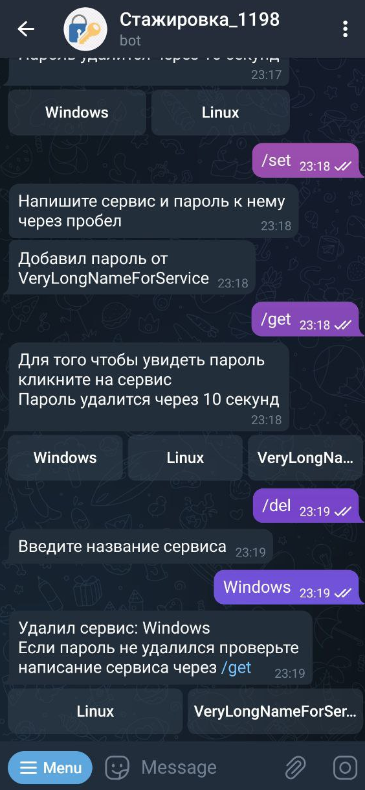

# Тестовый проект на стажировку в VK

Бот доступен круглосуточно по ссылке https://t.me/vk_intership_1198_bot

## Golang, PostgreSQL \ (Tarantool если останется время), Docker

Бот сохраняет серивисы и переданные пароли к ним, доступные команды:

1. /get - Выводит все доступные сервисы
2. /set - Устанавливает пароль для сервиса
3. /del - Удаляет сервис из хранилища
4. /help - Вызов справки
5. /start - Аналогично /help
6. /author - Выдает ссылку на автора

К командам /get добавляются **Inline кнопки** для быстрого взаимодействия

Каждый **пароль** сохраняется в БД в **зашифрованном** виде

Сообщения с паролем удаляются через 5 секунд после появления в чате

# How Install

    git clone https://github.com/Ghostik-gh/tg-Golang-VK.git

Приложение упаковано в Docker, запускается вместе с образом _postgres_, не забудьте вставить свой токен в _docker_compose.yml_

    docker-compose up --build

После выполнения этой команды будет 6-секундная задержка для того чтобы образ Postgres успел выполнить подготовку

DockerHub: https://hub.docker.com/r/ghostikgh/golang-bot - образ бота без postgres

# Examples

## /set

## /get

## /del

## /help

## Mobile

