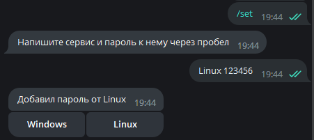
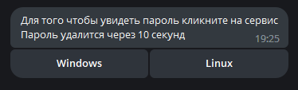
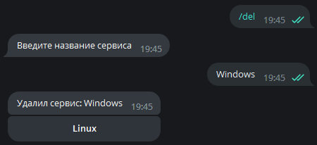
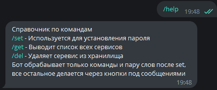
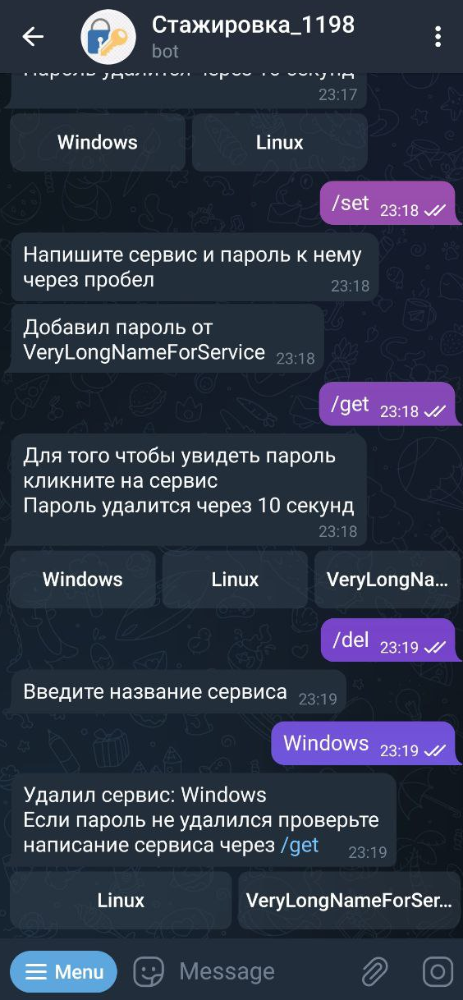

# Тестовый проект на стажировку в VK

Бот размещен на своем VPS сервере и доступен круглосуточно по ссылке https://t.me/vk_intership_1198_bot, либо в поиске телеграмма @vk_intership_1198_bot

## Golang, PostgreSQL, Docker

---

# Как работает

Бот сохраняет серивисы и переданные пароли к ним, доступные команды:

1. /get - Выводит все доступные сервисы
2. /set - Устанавливает пароль для сервиса
3. /del - Удаляет сервис из хранилища
4. /help - Вызов справки
5. /start - Аналогично /help
6. /author - Выдает ссылку на автора

К командам **не нужно передавать аргументы**

К командам /get добавляются **Inline кнопки** для быстрого взаимодействия

Каждый **пароль** сохраняется в БД в **зашифрованном** виде

Сообщения с паролем **удаляются через 5 секунд** после появления в чате

Приложение упаковано в **Docker**, запускается вместе с образом **postgres**

# Как запускать

Если вы хотите изменить бота можете скопировать весь репозиторий

    git clone https://github.com/Ghostik-gh/tg-Golang-VK.git

затем создайте config.json и внесите в него поле

    {
        "TelegramBotToken" : "YOURS:TOKEN"
    }

Сохраните свои изменения и соберите свой образ бота

    docker build -t ghostikgh/golang-bot .

после чего запустить

    docker-compose up --build

После выполнения этой команды будет 6-секундная задержка для того чтобы образ Postgres успел выполнить подготовку

DockerHub: https://hub.docker.com/r/ghostikgh/golang-bot - образ бота без postgres

# Что можно добавить

1. Перенести на Tarantool в качестве учебной задачи, потому что в данном случае in-memory БД будет неоправданной тратой ресурсов
2. Добавить сессии в которой нужно будет вводить произвольное число с помощью которого будут кодироваться и декодироваться все пароли, если при занесении в БД использовался один код, а при извлечении другой то пароль будет неверным.
3. Создать свою Инлайн панель для удаления сервиса
4. Сохранять не только пароль и навзание сервиса, но и логин
5. ~~Зарефакторить по папкам~~ почти как https://github.com/golang-standards/project-layout/tree/master
6. Написать тесты
7. Собрать конфиги в одном месте, скорее всего в docker-compose
8. Добавить minikube на свой сервер

  
Examples

### /set

### /get

### /del

### /help

### Mobile

